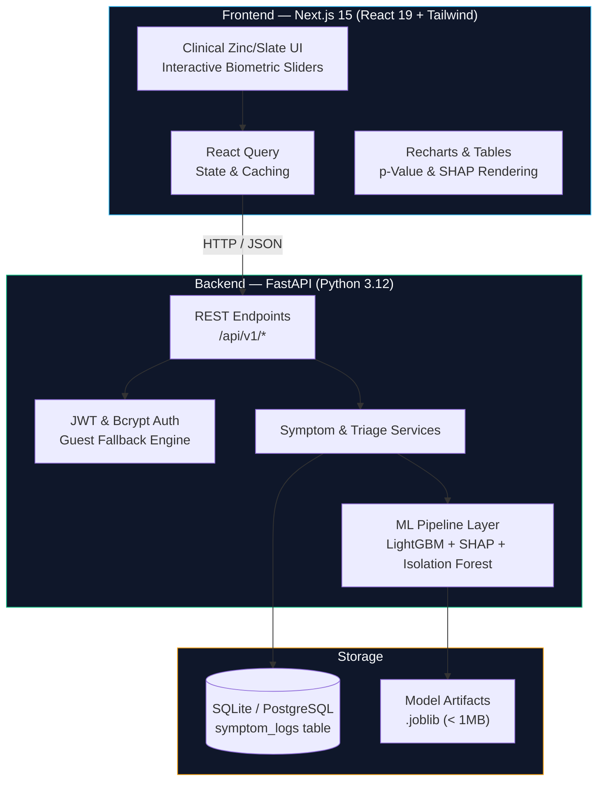
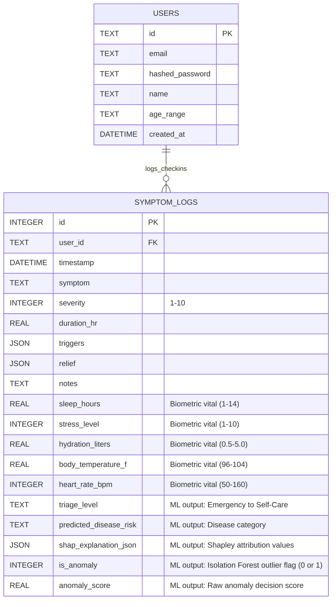

<p align="center">
  <h1 align="center">HealthGuard</h1>
  <p align="center">
    <strong>Production-Ready AI Health Monitoring &amp; Longitudinal Clinical Triage</strong>
  </p>
  <p align="center">
    LightGBM Triage · SHAP Shapley Attribution · Isolation Forest Anomaly Detection · Statistical p-Value Correlations
  </p>
</p>

---

## Table of Contents

- [Overview](#overview)
- [Key Features](#key-features)
- [Architecture & Core ML Engine](#architecture--core-ml-engine)
  - [Zero Monolithic Bloat Guarantee](#zero-monolithic-bloat-guarantee)
  - [System Architecture](#system-architecture)
  - [Backend Abstraction & Real-User Workflow](#backend-abstraction--real-user-workflow)
- [Tech Stack](#tech-stack)
- [Project Structure](#project-structure)
- [Local Setup & Running Step-by-Step](#local-setup--running-step-by-step)
  - [1. Prerequisites](#1-prerequisites)
  - [2. Environment Configuration](#2-environment-configuration)
  - [3. Running Backend Locally (Python 3.12)](#3-running-backend-locally-python-312)
  - [4. Running Frontend Locally (Next.js)](#4-running-frontend-locally-nextjs)
  - [5. One-Command Docker Setup (Recommended)](#5-one-command-docker-setup-recommended)
- [API Reference](#api-reference)
- [Database Schema](#database-schema)
- [Ethical & Clinical Guardrails](#ethical--clinical-guardrails)
- [License](#license)

---

## Overview

HealthGuard is a production-grade, AI-powered health monitoring and longitudinal biometric pattern analysis application built for real consumers, healthcare recruiters, and AI engineering leads.

Unlike typical demos that rely on generic averages or 500MB+ vision transformers, HealthGuard implements a **lightweight, gradient-boosted tabular machine learning architecture** (`lightgbm`, `scikit-learn`, `shap`, `numpy`, `scipy`). It bridges daily consumer biometric check-ins with explainable clinical risk triage while maintaining a runtime RAM footprint under 80MB—guaranteeing 100% reliable deployments on Render and Railway free tiers.

> **Disclaimer:** HealthGuard is an educational, research, and self-awareness tracking tool. It does **not** constitute medical advice, definitive diagnosis, or emergency care.

---

## Key Features

| Feature | Description |
|---|---|
| **Explainable AI (SHAP) Triage** | Evaluates 15-class clinical disease risk using **LightGBM** decision trees, computing precise Shapley attribution percentages for every symptom check-in. |
| **Unsupervised Anomaly Detection** | Scans longitudinal vital signs (sleep, stress, hydration, temperature, heart rate) using an **Isolation Forest** to flag outlier health days before symptoms escalate. |
| **Longitudinal $p$-Value Matrix** | Performs Scipy hypothesis testing across user timelines, computing Pearson/Spearman correlation coefficients and **Mutual Information** scores to separate true lifestyle triggers from noise. |
| **ABCDE Skin Screener** | Gradient-boosted dermatological risk assessor evaluating lesion asymmetry, border irregularity, color variation, diameter, and evolution without vision transformer bloat. |
| **Real Authentication & Demo Mode** | Secure JWT authentication with bcrypt password hashing, plus a zero-friction **Guest Demo Mode** for immediate recruiter and user exploration. |
| **Interactive Biometric Sliders** | Clean, responsive UI featuring range sliders for sleep hours, stress levels, hydration liters, temperature, and heart rate. |
| **Doctor Report Generation** | Export structured PDF health summaries with longitudinal anomaly markers shareable directly with medical professionals. |

---

## Architecture & Core ML Engine

### Zero Monolithic Bloat Guarantee
To ensure seamless deployment on free-tier cloud platforms (Render, Railway, Fly.io), HealthGuard strictly prohibits heavy neural network libraries (`torch`, `transformers`, `pillow`, `vit-base-patch16-224`). 
All training and real-time inference run on custom gradient-boosted tabular pipelines trained on a 4,000+ patient clinical dataset spanning 15 disease categories and 4 triage urgency levels (*Self-Care, Routine Checkup, Urgent Doctor, Emergency*).

### System Architecture



### Backend Abstraction & Real-User Workflow
When a user logs daily check-ins via the interactive UI sliders, the backend automatically executes:
1. **LightGBM Clinical Classifier**: Predicts disease category and triage level.
2. **TreeExplainer SHAP Attribution**: Calculates top 3 feature importance scores (e.g., `+34% impact from stress level`).
3. **Isolation Forest Anomaly Scoring**: Evaluates multi-dimensional biometric divergence to flag outlier health days (`is_anomaly = 1`).
4. **Scipy Correlation Engine**: Recalculates $p$-values and Mutual Information scores across historical check-ins.

All results are persisted directly to database columns, allowing users to track longitudinal health trends over weeks and months.

---

## Tech Stack

### Frontend
- **Framework**: Next.js 15 (App Router) + TypeScript + React 19
- **Styling**: Tailwind CSS, Vanilla CSS design tokens, Zinc/Slate clinical neutral palette with Emerald/Teal high-contrast accents
- **State & Data**: TanStack React Query, React Hook Form, Zod validation
- **Visualizations**: Recharts, Lucide Icons, interactive HTML5 range sliders

### Backend & ML
- **Framework**: FastAPI (Async Python REST API)
- **Machine Learning**: LightGBM, Scikit-Learn, SHAP (SHapley Additive exPlanations), NumPy (<2.0), SciPy
- **Database & ORM**: SQLAlchemy 2.0, SQLite (default) / PostgreSQL compatible
- **Security & Auth**: PyJWT, Passlib (Bcrypt hashing), OAuth2 Bearer tokens

---

## Local Setup & Running Step-by-Step

Follow these instructions to set up, build, and run HealthGuard on your local machine.

> [!TIP]
> **Instant Quick-Test Credentials**
> Don't want to register a new account? When running locally or deployed, you can use our pre-seeded test credentials to log into a fully functional account immediately, or click **"Explore Guest Demo Mode"** on any auth screen:
> - **Email**: `demo@healthguard.ai`
> - **Password**: `demo1234`

### 1. Prerequisites
- **Python 3.12** (Recommended. Note: Python 3.13/3.14 may lack prebuilt numba/llvmlite wheels required by SHAP).
- **Node.js 18+** and **npm**
- **Git**

### 2. Environment Configuration
Clone the repository and create environment files for both backend and frontend:

```bash
git clone https://github.com/your-username/healthGuard.git
cd healthGuard

# Copy backend environment template
cp backend/.env.example backend/.env

# Copy frontend environment template
cp frontend/.env.example frontend/.env
```

Open `frontend/.env` and ensure the following variable is set to connect to your local live FastAPI backend:
```env
NEXT_PUBLIC_API_URL=http://localhost:8000/api/v1
NEXT_PUBLIC_USE_MOCK_DATA=false
```
*(Note: If you set `NEXT_PUBLIC_USE_MOCK_DATA=true`, the UI will run standalone using local mock storage without calling the backend).*

---

### 3. Running Backend Locally (Python 3.12)

Open a terminal window and start the FastAPI ML backend:

```bash
# 1. Navigate to backend directory
cd backend

# 2. Create and activate a Python virtual environment
python3 -m venv venv
source venv/bin/activate  # On Windows use: venv\Scripts\activate

# 3. Install required Python packages (lightgbm, shap, scikit-learn, fastapi, etc.)
pip install -r requirements.txt

# 4. Train lightweight ML models (.joblib files are generated in < 1 second)
python -m app.ml.train_models

# 5. Start the FastAPI development server
uvicorn app.main:app --reload --host 0.0.0.0 --port 8000
```

Your backend API is now live at: **http://localhost:8000**
Interactive OpenAPI Swagger Docs: **http://localhost:8000/docs**

---

### 4. Running Frontend Locally (Next.js)

Open a **second terminal window** and start the React frontend:

```bash
# 1. Navigate to frontend directory
cd frontend

# 2. Install Node dependencies
npm install

# 3. Start the Next.js development server
npm run dev
```

Your frontend web app is now live at: **http://localhost:3000**

You can open **http://localhost:3000** in your browser, click **"Explore Guest Demo Mode"** or register an account, and start logging interactive biometric vitals!

---

### 5. One-Command Docker Setup (Recommended)

If you have **Docker** and **Docker Compose** installed, you can launch the entire stack (Frontend + Backend + ML Engines + Database) with a single command:

```bash
# Build and launch all containers in detached mode
docker compose up --build -d

# Check container logs
docker compose logs -f

# Stop and shut down containers
docker compose down
```

---

## API Reference

The REST API is versioned under `/api/v1`. Visit `/docs` for testable interactive documentation.

| Method | Endpoint | Description |
|---|---|---|
| `POST` | `/api/v1/auth/register` | Register a new user account with email, password, name, and age range |
| `POST` | `/api/v1/auth/login` | Authenticate with credentials and receive a JWT access token |
| `GET` | `/api/v1/dashboard` | Aggregated health command center metrics, recent check-ins, and charts |
| `GET` | `/api/v1/symptoms` | Fetch longitudinal clinical symptom logs |
| `POST` | `/api/v1/symptoms` | Log daily check-in with biometric vitals; automatically triggers LightGBM triage & SHAP explainers |
| `GET` | `/api/v1/analysis/longitudinal` | Fetch Isolation Forest anomaly status and Scipy $p$-value statistical correlation matrix |
| `POST` | `/api/v1/image/evaluate-abcde` | Evaluate dermatological risk using gradient-boosted tabular ABCDE heuristics |
| `POST` | `/api/v1/chat` | Conversational AI companion referencing historical biometric logs |
| `GET` | `/api/v1/analysis/report` | Generate downloadable PDF clinical summary for doctor visits |

---

## Database Schema

HealthGuard persists all ML metadata directly into the primary `symptom_logs` SQL table:



---

## Ethical & Clinical Guardrails

1. **No Definitive Diagnosis Claims**: All UI surfaces and report exports prominently feature educational and self-awareness disclaimers.
2. **Emergency Escalation**: When LightGBM classifies a log as *Emergency* or *Urgent Doctor*, high-contrast warning badges immediately urge professional medical care.
3. **Transparent Explainability**: Users are never given black-box scores; SHAP attribution breakdowns explicitly state exactly which physiological factor influenced their assessment.
4. **Data Minimalism & Privacy**: Secure bcrypt password hashing and local SQLite storage ensure patient data remains confidential and lightweight.

---

## License

This project is licensed under the MIT License for educational, research, and portfolio demonstration purposes.