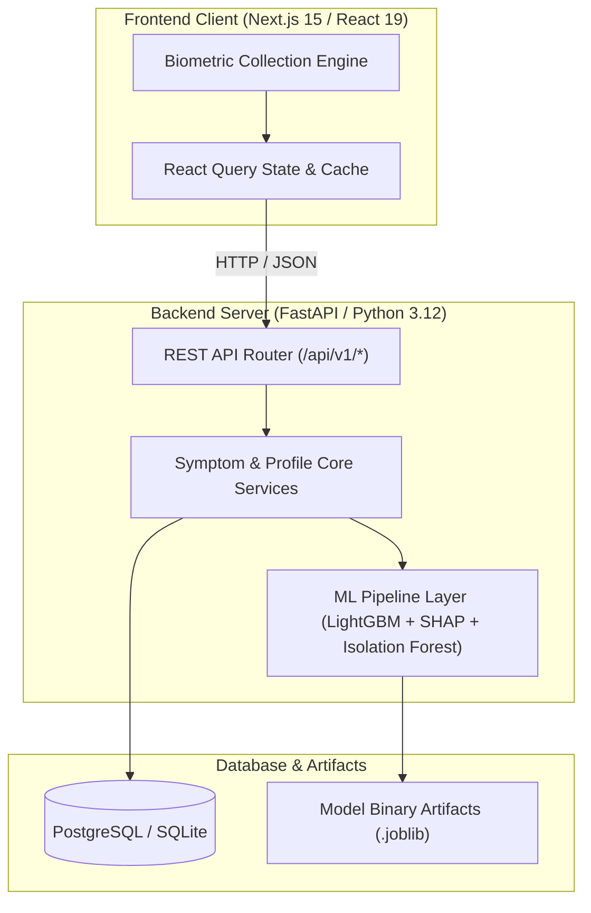
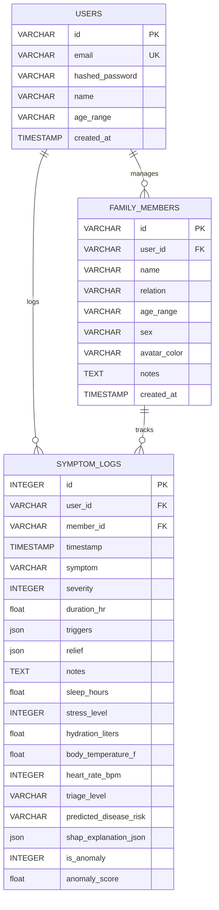

# HealthGuard

HealthGuard is a clinical-grade, AI-powered health monitoring and longitudinal biometric pattern analysis application. It evaluates daily consumer biometric check-ins to generate explainable clinical risk triage assessments.

---

## Machine Learning Pipeline

- **Clinical Triage (LightGBM & SHAP)**: Classifies symptom profiles into 15 disease categories and 4 triage urgency levels (*Self-Care, Routine Checkup, Urgent Doctor, Emergency*). Calculates local SHAP attribution values to detail the impact of individual vitals.
- **Anomaly Detection (Isolation Forest)**: Analyzes multi-dimensional vitals (sleep, stress, hydration, temperature, heart rate) longitudinally to flag biometric outliers.
- **Trigger Analysis (SciPy)**: Computes Pearson/Spearman correlation coefficients and Mutual Information scores to map lifestyle triggers to symptom severities.
- **Dermatology Screener**: Evaluates skin lesion risks using a gradient-boosted tabular ABCDE scoring heuristic.

---

## Architecture



---

## Tech Stack

- **Frontend Client**: Next.js 15 (App Router), React 19, TypeScript, Recharts, React Query
- **Backend Server**: FastAPI, SQLAlchemy 2.0, PostgreSQL (default) / SQLite compatible, PyJWT, Bcrypt
- **Machine Learning**: LightGBM, Scikit-Learn, SHAP, NumPy, SciPy

---

## Setup & Running

### Environment Configuration
Clone the repository and set up environment files:

```bash
git clone https://github.com/rj9884/healthGuard.git
cd healthGuard
cp backend/.env.example backend/.env
cp frontend/.env.example frontend/.env
```

Ensure `frontend/.env` is configured to point to your backend endpoint:
```env
NEXT_PUBLIC_API_URL=http://localhost:8000/api/v1
NEXT_PUBLIC_USE_MOCK_DATA=false
```

### Docker Deployment (Recommended)
Launch the entire stack (PostgreSQL database, FastAPI backend, and Next.js frontend):

```bash
docker compose up --build -d
```

### Local Setup

#### Backend Server
```bash
cd backend
python3 -m venv venv
source venv/bin/activate
pip install -r requirements.txt
python -m app.ml.train_models
uvicorn app.main:app --reload --host 0.0.0.0 --port 8000
```
Interactive documentation is available at `http://localhost:8000/docs`.

#### Frontend Client
```bash
cd frontend
npm install
npm run dev
```
The client will run at `http://localhost:3000`.

---

## Database Schema


