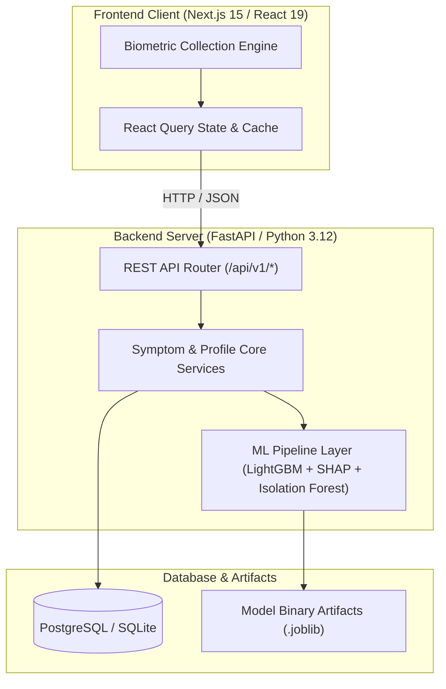

# HealthGuard

HealthGuard is a family health-tracking app that gives every check-in a clear, explainable risk assessment instead of a black-box score. One account supports multiple family member profiles, each with its own symptom history, medication list, and longitudinal pattern analysis.

---

## Table of Contents

- [Features](#features)
- [Machine Learning Pipeline](#machine-learning-pipeline)
- [Architecture](#architecture)
- [Tech Stack](#tech-stack)
- [API Overview](#api-overview)
- [Performance & Evaluation Benchmarks](#performance--evaluation-benchmarks)
- [Setup & Running](#setup--running)
- [Known Limitations & Roadmap](#known-limitations--roadmap)

---

## Features

- **Family profiles**: one login, multiple named members (Netflix-style profile switching), each with independent history.
- **Symptom logging**: structured check-ins covering symptoms, severity, duration, triggers, relief methods, and vitals (sleep, stress, hydration, temperature, heart rate).
- **Explainable triage**: every log gets a disease-category prediction, a triage urgency level, and a SHAP-based breakdown of which inputs drove that result.
- **Anomaly detection**: an Isolation Forest model flags check-ins that look statistically unusual against a member's own history.
- **Pattern & trigger analysis**: correlation and mutual-information testing across a member's timeline to separate real lifestyle triggers from coincidence.
- **Medication guidance**: suggestions grounded in the WHO Essential Medicines List, enriched with label data from the openFDA Drug Label API.
- **Dermatology screener**: a tabular ABCDE-heuristic risk check for skin lesion photos/descriptions.
- **AI chat**: conversational interface for asking questions about a member's logged health data.

---

## Machine Learning Pipeline

- **Clinical Triage (LightGBM + SHAP)**: classifies symptom profiles into 15 disease categories and 4 triage urgency levels (*Self-Care, Routine Checkup, Urgent Doctor, Emergency*), with SHAP TreeExplainer attribution values showing exactly which inputs drove each prediction.
- **Anomaly Detection (Isolation Forest)**: scans multi-dimensional vitals (sleep, stress, hydration, temperature, heart rate) longitudinally to flag outlier check-ins.
- **Trigger Analysis (SciPy)**: computes Pearson/Spearman correlation coefficients and mutual information scores to map lifestyle triggers to symptom severity over time.
- **Dermatology Screener**: a gradient-boosted tabular model applying ABCDE scoring heuristics to skin lesion risk.

---

## Architecture



---

## Tech Stack

| Layer | Technologies |
| :--- | :--- |
| Frontend | Next.js 15 (App Router), React 19, TypeScript, Tailwind CSS, React Query, Recharts, React Hook Form, Zod |
| Backend | FastAPI, SQLAlchemy 2.0, Pydantic v2, PyJWT, Passlib (bcrypt) |
| Database | PostgreSQL (default, containerized) / SQLite (local dev) |
| Machine Learning | LightGBM, scikit-learn, SHAP, NumPy, SciPy, pandas |
| Infrastructure | Docker, Docker Compose |

---

## API Overview

All endpoints are served under `/api/v1`. Interactive documentation is available at `/docs` once the backend is running.

| Prefix | Responsibility |
| :--- | :--- |
| `/auth` | Registration, login, session/token handling |
| `/members` | Family member profile CRUD |
| `/dashboard` | Member-scoped summary and stats |
| `/symptoms` | Symptom logging and the triage/anomaly pipeline |
| `/chat` | AI chat over a member's logged health data |
| `/analysis` | Longitudinal pattern and trigger analysis |
| `/medications` | WHO/openFDA-backed medication suggestions |
| `/image` | Dermatology (ABCDE) image/description evaluation |

---

## Performance & Evaluation Benchmarks

HealthGuard includes a reproducible benchmark suite (`benchmarks/`) covering model classification quality, anomaly-engine scaling under growing log history, and concurrent HTTP load testing. Full methodology, raw JSON output, and a detailed bottleneck analysis are in [`benchmarks/results/summary.md`](benchmarks/results/summary.md); reproduction steps are in [`benchmarks/README.md`](benchmarks/README.md).

### Model Classification Quality

Evaluated on an 80/20 train/test split (see the dataset note below for what this data represents):

| Model | Accuracy | F1-Score (Weighted) | Evaluation Set |
| :--- | :---: | :---: | :--- |
| Clinical Disease Router (LightGBM) | 100.00% | 1.000 | 900 test samples |
| Clinical Triage Classifier (LightGBM) | 99.89% | 0.999 | 900 test samples |
| Skin Lesion Screener (LightGBM / RF) | 81.33% | 0.807 | 300 test samples |

### Inference Latency

| Operation | Mean | p95 | p99 |
| :--- | :---: | :---: | :---: |
| Clinical Triage Inference | 4.26 ms | 4.98 ms | 5.31 ms |
| SHAP Explanation Generation | 64.12 ms | 15.01 ms | 1,004.22 ms |
| Skin Screener Inference | 1.94 ms | 2.11 ms | 2.34 ms |

### Anomaly & Correlation Engine Scaling

Execution time as a member's historical log count grows from 5 to 2,000 entries:

| Log History | Mean Latency | p95 Latency |
| :---: | :---: | :---: |
| 5 logs | 188.65 ms | 238.97 ms |
| 100 logs | 168.49 ms | 172.54 ms |
| 500 logs | 208.60 ms | 242.84 ms |
| 2,000 logs | 288.46 ms | 295.04 ms |

### Concurrency & Identified Bottleneck

Concurrent load testing on `POST /api/v1/symptoms` (concurrency levels 1 to 20) surfaced a p95 latency of 13.5 seconds at 20 concurrent requests. Request-stage instrumentation traced this to the Isolation Forest anomaly engine holding the Python GIL under CPU-bound load, not outbound network calls to openFDA as originally suspected. Planned remedies: running Uvicorn with multiple worker processes, and offloading anomaly detection to a `ProcessPoolExecutor`. Full breakdown, including the openFDA caching effect, is in [`benchmarks/results/summary.md`](benchmarks/results/summary.md).

### Dataset Note

The classification numbers above reflect performance on the current training dataset (`backend/app/ml/dataset_generator.py`), which is synthetically generated rather than sourced from real patient records. A retrofit onto DDXPlus, a clinically grounded synthetic dataset built from real disease-symptom relationships, is in progress; vitals (sleep, stress, hydration, temperature, heart rate) will remain simulated regardless, since no public dataset pairs symptom data with that kind of biometric history. Benchmarks will be re-run once the retrofit lands.

---

## Setup & Running

### Environment Configuration

```bash
git clone https://github.com/rj9884/healthGuard.git
cd healthGuard
cp backend/.env.example backend/.env
cp frontend/.env.example frontend/.env
```

Ensure `frontend/.env` points to your backend endpoint:
```env
NEXT_PUBLIC_API_URL=http://localhost:8000/api/v1
NEXT_PUBLIC_USE_MOCK_DATA=false
```

### Docker Deployment (Recommended)

Launches PostgreSQL, the FastAPI backend, and the Next.js frontend together:

```bash
docker compose up --build -d
```

### Local Setup

#### Backend
```bash
cd backend
python3 -m venv venv
source venv/bin/activate
pip install -r requirements.txt
python -m app.ml.train_models
uvicorn app.main:app --reload --host 0.0.0.0 --port 8000
```
Interactive API docs: `http://localhost:8000/docs`

#### Frontend
```bash
cd frontend
npm install
npm run dev
```
Runs at `http://localhost:3000`

---

## Known Limitations & Roadmap

- **Synthetic training data**: the ML pipeline is currently trained on a synthetically generated dataset, not real clinical records. Near-perfect accuracy figures above should be read in that context, not as a claim of real-world clinical validation.
- **DDXPlus retrofit in progress**: real symptom-disease relationships from the DDXPlus dataset are being integrated to replace hand-tuned probability estimates; vitals will remain simulated.
- **Concurrency bottleneck**: the anomaly engine currently blocks under concurrent load (see Benchmarks above); multi-worker/process-pool offloading is planned but not yet implemented.
- **Not a medical device**: HealthGuard is for educational and personal-tracking purposes only. It does not provide medical advice or diagnosis, and is not a substitute for consulting a qualified healthcare provider.
