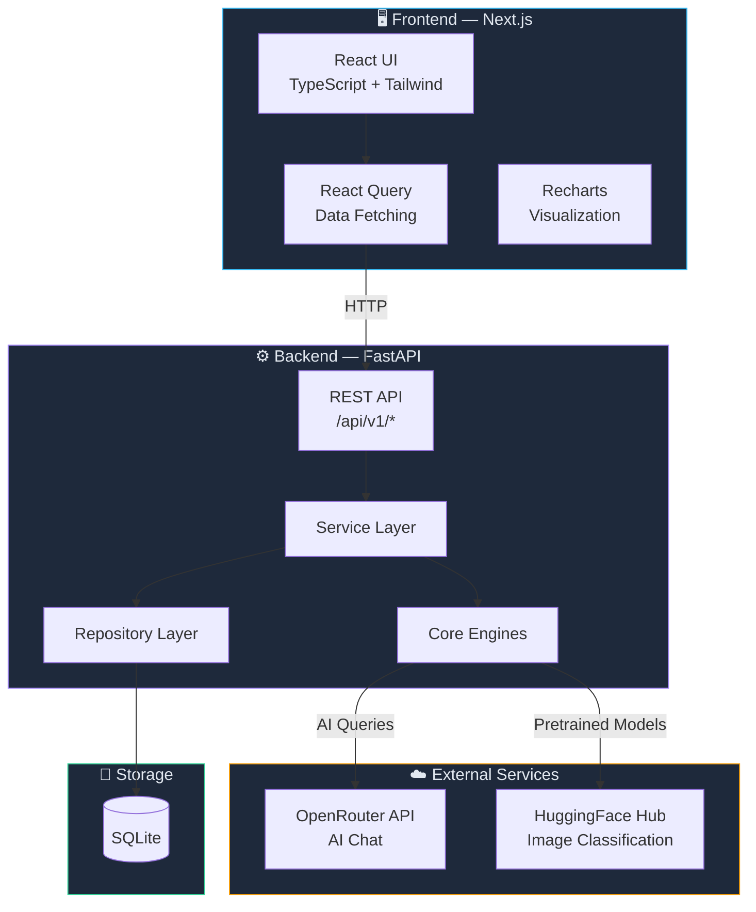
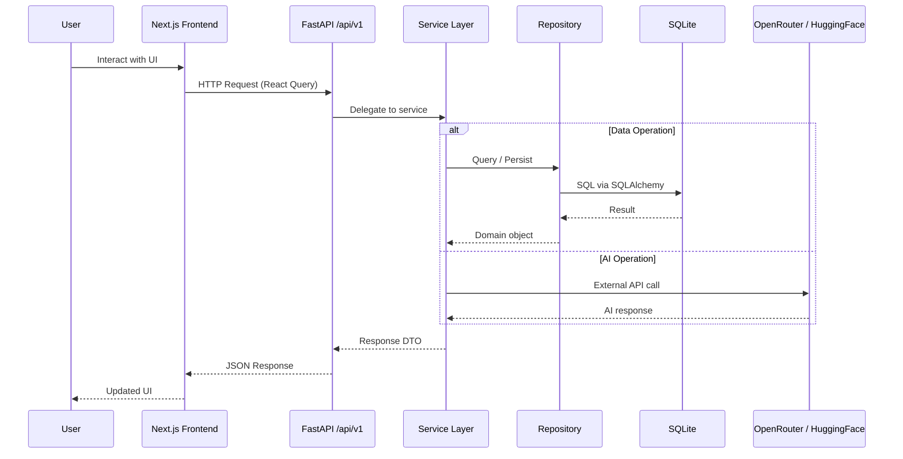
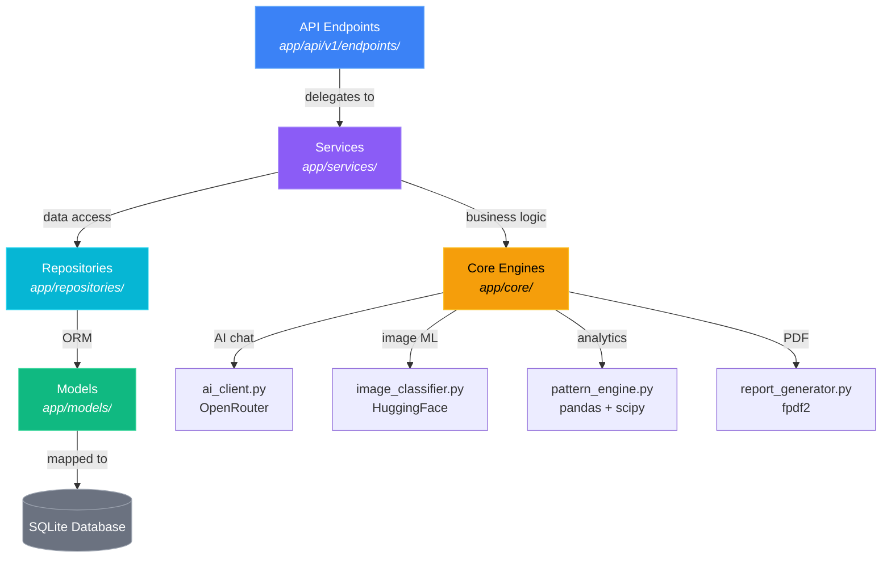
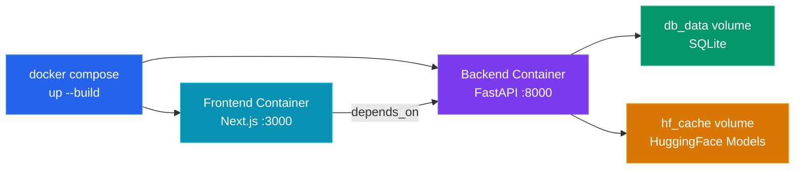
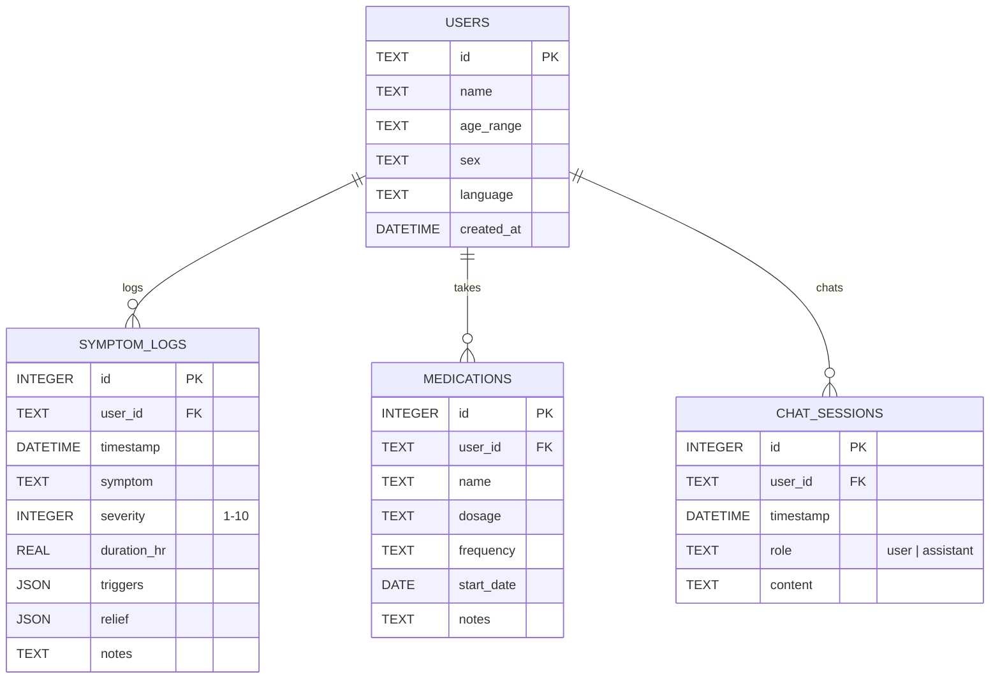

<p align="center">
  <h1 align="center">🛡️ HealthGuard</h1>
  <p align="center">
    <strong>AI-Powered Health Monitoring &amp; Pattern Analysis</strong>
  </p>
  <p align="center">
    Track symptoms · Spot patterns · Chat with AI · Screen skin conditions · Manage medications
  </p>
</p>

---

## Table of Contents

- [Overview](#overview)
- [Key Features](#key-features)
- [Architecture](#architecture)
  - [System Overview](#system-overview)
  - [Request Flow](#request-flow)
  - [Backend Layered Architecture](#backend-layered-architecture)
- [Tech Stack](#tech-stack)
- [Project Structure](#project-structure)
- [Getting Started](#getting-started)
  - [Prerequisites](#prerequisites)
  - [Environment Variables](#environment-variables)
  - [Local Development](#local-development)
  - [Docker (Recommended)](#docker-recommended)
- [API Reference](#api-reference)
- [Database Schema](#database-schema)
- [Configuration](#configuration)
- [Ethical Considerations](#ethical-considerations)
- [License](#license)

---

## Overview

HealthGuard is a full-stack health monitoring application that helps users track symptoms, discover hidden health patterns through AI-driven analysis, and make informed decisions about seeking medical care. It combines a **FastAPI** backend with a modern **Next.js** frontend, connected via a versioned REST API.

> **⚠️ Disclaimer:** HealthGuard is an educational and informational tool — it is **not** a substitute for professional medical advice, diagnosis, or treatment.

---

## Key Features

| Feature | Description |
|---|---|
| ** Dashboard** | At-a-glance health summary — recent symptoms, severity trends, and quick stats |
| ** Symptom Logging** | Log symptoms with severity (1–10), duration, triggers, relief measures, and notes |
| ** Pattern Analysis** | Automated trigger-confidence scoring using pandas/scipy to surface hidden correlations |
| ** AI Health Chat** | Conversational AI companion (via OpenRouter) that references your logged history |
| ** Skin Screener** | Upload a photo for preliminary visual classification using HuggingFace pretrained models |
| ** Medication Tracker** | CRUD interface for medications with dosage, frequency, and scheduling |
| ** Report Export** | Generate structured PDF health summaries shareable with a doctor |

---

## Architecture

### System Overview



### Request Flow



### Backend Layered Architecture



---

## Tech Stack

### Frontend

| Technology | Purpose |
|---|---|
| **Next.js 15** (App Router) | React framework with SSR and file-based routing |
| **TypeScript** | Type safety across the frontend |
| **Tailwind CSS** | Utility-first styling |
| **shadcn/ui-style components** | Accessible, composable UI primitives |
| **React Query** | Server state management and caching |
| **React Hook Form + Zod** | Form handling with schema validation |
| **Recharts** | Interactive health data visualizations |
| **Lucide React** | Icon system |

### Backend

| Technology | Purpose |
|---|---|
| **FastAPI** | Async Python REST API with auto-generated OpenAPI docs |
| **SQLAlchemy** | ORM for database modeling and queries |
| **pandas + scipy** | Statistical pattern analysis and correlation detection |
| **OpenRouter API** | LLM-backed AI health chat companion |
| **HuggingFace Transformers** | Pretrained image classification for skin screening |
| **fpdf2** | PDF health report generation |
| **SQLite** | Lightweight, zero-config database |

### Infrastructure

| Technology | Purpose |
|---|---|
| **Docker Compose** | Multi-container orchestration (one-command startup) |
| **Named Volumes** | Persistent storage for SQLite DB and HuggingFace model cache |

---

## Project Structure

```text
healthGuard/
├── backend/
│   ├── app/
│   │   ├── api/v1/endpoints/     # Route handlers (dashboard, symptoms, chat, etc.)
│   │   ├── core/                 # AI client, pattern engine, image classifier, report gen
│   │   ├── models/               # SQLAlchemy ORM models
│   │   ├── repositories/         # Data access layer
│   │   ├── schemas/              # Pydantic request/response schemas
│   │   ├── services/             # Business logic layer
│   │   ├── config.py             # Environment and app settings
│   │   └── main.py               # FastAPI app entry point
│   ├── data/                     # Static reference data
│   ├── tests/                    # Backend test suite
│   ├── Dockerfile
│   └── requirements.txt
│
├── frontend/
│   ├── src/
│   │   ├── app/(product)/        # Next.js pages (dashboard, symptoms, chat, etc.)
│   │   ├── components/           # Shared UI components + layout
│   │   ├── features/             # Feature-specific modules (chat, dashboard, patterns…)
│   │   └── lib/                  # Utilities, API client, hooks
│   ├── Dockerfile
│   └── package.json
│
├── docker-compose.yml            # Orchestrates backend + frontend containers
├── .env.example                  # Environment variable template
└── AI_Powered_Health_App_Idea.md # Product/functional reference document
```

---

## Getting Started

### Prerequisites

- **Python 3.12+** and **pip** (for backend)
- **Node.js 18+** and **npm** (for frontend)
- **Docker** and **Docker Compose** (optional, for containerized setup)

### Environment Variables

Copy the example file and fill in your keys:

```bash
cp .env.example .env
```

| Variable | Required | Description |
|---|---|---|
| `OPENROUTER_API_KEY` | Yes | API key for AI chat (get from [openrouter.ai](https://openrouter.ai)) |
| `OPENROUTER_MODEL` | No | LLM model to use (default: `qwen/qwen3-coder:free`) |
| `OPENFDA_API_KEY` | No | OpenFDA key for medication interactions |
| `DATABASE_URL` | No | SQLite connection string (auto-configured) |
| `NEXT_PUBLIC_API_URL` | No | Backend API URL for the frontend |
| `NEXT_PUBLIC_USE_MOCK_DATA` | No | Set `true` to use mock data for UI development |

### Local Development

**Backend:**

```bash
cd backend
pip install -r requirements.txt
uvicorn app.main:app --reload --port 8000
```

**Frontend:**

```bash
cd frontend
npm install
npm run dev
```

| Service | URL |
|---|---|
| Frontend | http://localhost:3000 |
| Backend API Docs | http://localhost:8000/docs |

> **Tip:** The frontend defaults to mock data so UI renders immediately without a running backend. Set `NEXT_PUBLIC_USE_MOCK_DATA=false` in `.env` to use live API data.

### Docker (Recommended)



```bash
# Build and start all services
docker compose up --build

# Run in detached mode
docker compose up -d

# Stop services (data preserved in volumes)
docker compose down

# Stop and wipe all data
docker compose down -v
```

---

## API Reference

All endpoints are served under `/api/v1`. Interactive documentation is available at `/docs` when the backend is running.

| Method | Endpoint | Description |
|---|---|---|
| `GET` | `/api/v1/dashboard` | Aggregated health dashboard data |
| `GET` | `/api/v1/symptoms` | List symptom logs |
| `POST` | `/api/v1/symptoms` | Create a new symptom entry |
| `GET` | `/api/v1/analysis/summary` | Pattern analysis summary |
| `GET` | `/api/v1/analysis/patterns/{symptom}` | Trigger analysis for a specific symptom |
| `GET` | `/api/v1/analysis/report` | Generate PDF health report |
| `POST` | `/api/v1/chat` | Send a message to the AI companion |
| `GET` | `/api/v1/medications` | List medications |
| `POST` | `/api/v1/medications` | Add a medication |
| `DELETE` | `/api/v1/medications/{id}` | Remove a medication |
| `POST` | `/api/v1/image/classify` | Upload image for skin condition screening |

---

## Database Schema



---

## Configuration

The backend reads configuration from environment variables via `app/config.py`. All settings can be overridden through the `.env` file or Docker environment.

| Setting | Default | Description |
|---|---|---|
| `DATABASE_URL` | `sqlite:///./health_monitor.db` | Database connection string |
| `OPENROUTER_API_KEY` | — | Required for AI chat functionality |
| `OPENROUTER_MODEL` | `qwen/qwen3-coder:free` | LLM model used for health chat |
| `HF_HOME` | System default | HuggingFace model cache directory |

---

## Ethical Considerations

-  **No diagnosis claims** — All AI outputs include educational-only disclaimers
-  **Emergency referrals** — High-severity or dangerous symptom combinations surface professional care recommendations
-  **Transparency** — AI limitations and confidence levels are always visible to the user
-  **Mental health awareness** — Crisis resources are surfaced when mental health symptoms are detected
-  **Data minimalism** — No sensitive data is stored beyond what the user explicitly logs

---

## License

This project is for educational and demonstration purposes.