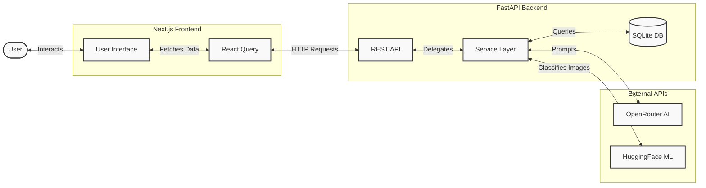
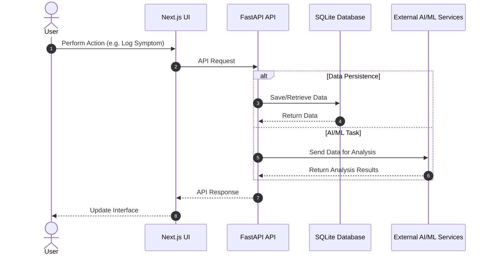
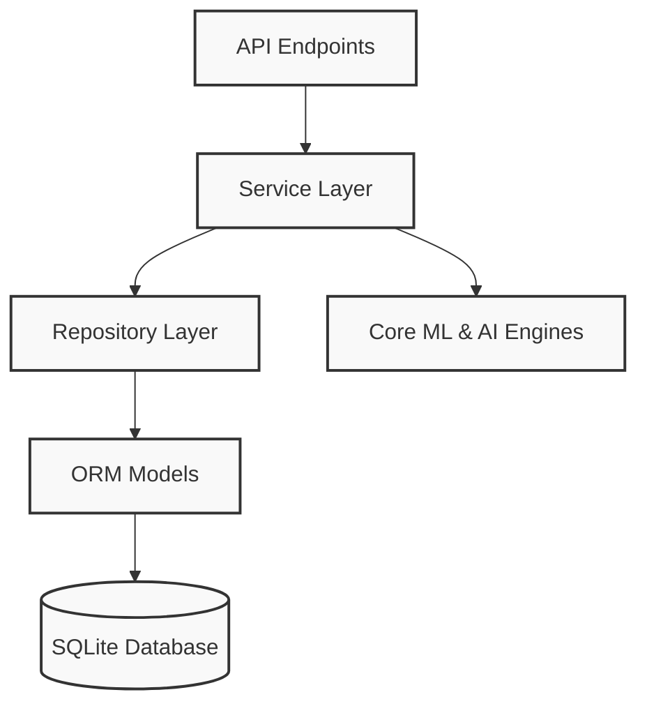
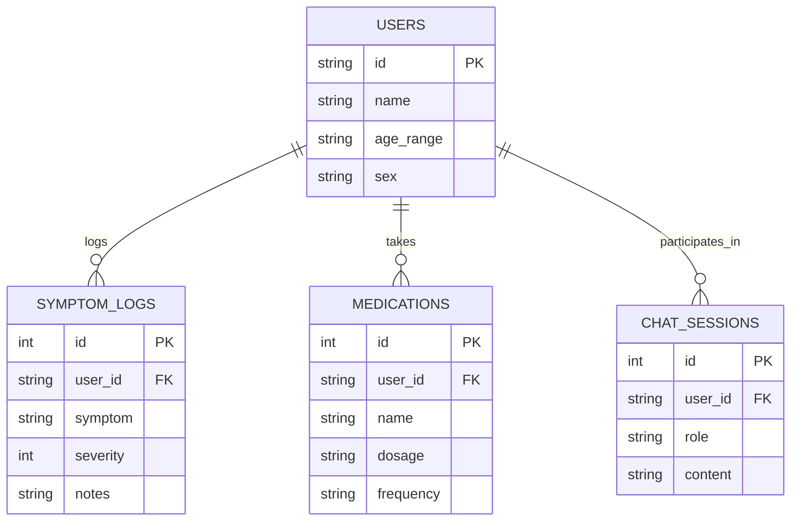

# HealthGuard Diagrams

## 1. System Overview

```mermaid
flowchart LR
    User([User])
    
    subgraph Frontend [Next.js Frontend]
        UI[User Interface]
        State[React Query]
    end
    
    subgraph Backend [FastAPI Backend]
        API[REST API]
        Services[Service Layer]
        DB[(SQLite DB)]
    end
    
    subgraph External [External APIs]
        AI[OpenRouter AI]
        ML[HuggingFace ML]
    end
    
    User <-->|Interacts| UI
    UI <-->|Fetches Data| State
    State <-->|HTTP Requests| API
    API <-->|Delegates| Services
    Services <-->|Queries| DB
    Services <-->|Prompts| AI
    Services <-->|Classifies Images| ML
    
    classDef default fill:#f9f9f9,stroke:#333,stroke-width:2px;
```

## 2. Request Flow

```mermaid
sequenceDiagram
    autonumber
    actor User
    participant Frontend as Next.js UI
    participant Backend as FastAPI API
    participant DB as SQLite Database
    participant AI as External AI/ML Services

    User->>Frontend: Perform Action (e.g. Log Symptom)
    Frontend->>Backend: API Request
    
    alt Data Persistence
        Backend->>DB: Save/Retrieve Data
        DB-->>Backend: Return Data
    else AI/ML Task
        Backend->>AI: Send Data for Analysis
        AI-->>Backend: Return Analysis Results
    end
    
    Backend-->>Frontend: API Response
    Frontend-->>User: Update Interface
```

## 3. Backend Layered Architecture

```mermaid
flowchart TD
    API[API Endpoints] --> Services[Service Layer]
    Services --> Repositories[Repository Layer]
    Services --> Core[Core ML & AI Engines]
    Repositories --> Models[ORM Models]
    Models --> DB[(SQLite Database)]
    
    classDef default fill:#f9f9f9,stroke:#333,stroke-width:2px;
```

## 4. Database Schema

```mermaid
erDiagram
    USERS ||--o{ SYMPTOM_LOGS : "logs"
    USERS ||--o{ MEDICATIONS : "takes"
    USERS ||--o{ CHAT_SESSIONS : "participates_in"

    USERS {
        string id PK
        string name
        string age_range
        string sex
    }
    
    SYMPTOM_LOGS {
        int id PK
        string user_id FK
        string symptom
        int severity
        string notes
    }
    
    MEDICATIONS {
        int id PK
        string user_id FK
        string name
        string dosage
        string frequency
    }
    
    CHAT_SESSIONS {
        int id PK
        string user_id FK
        string role
        string content
    }
```
